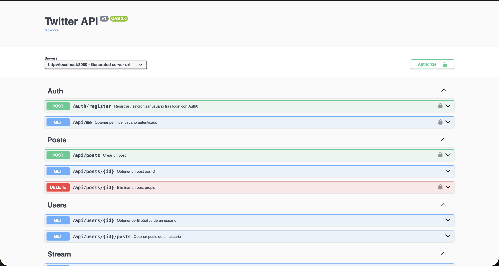
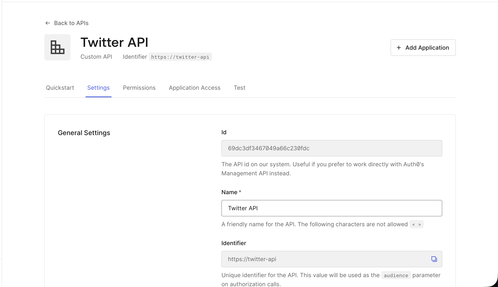
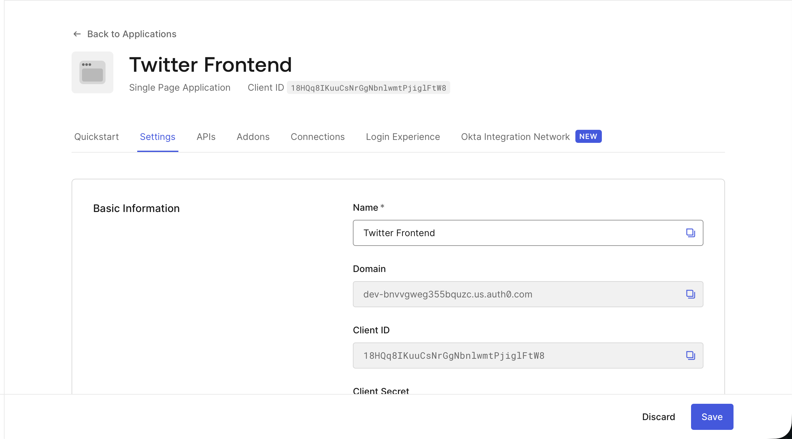
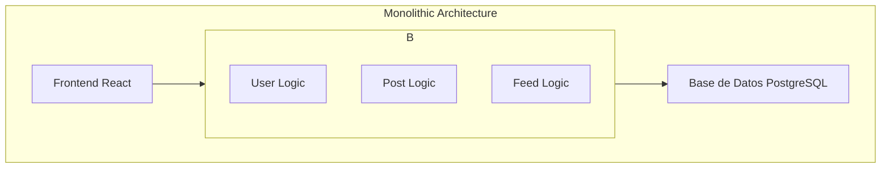
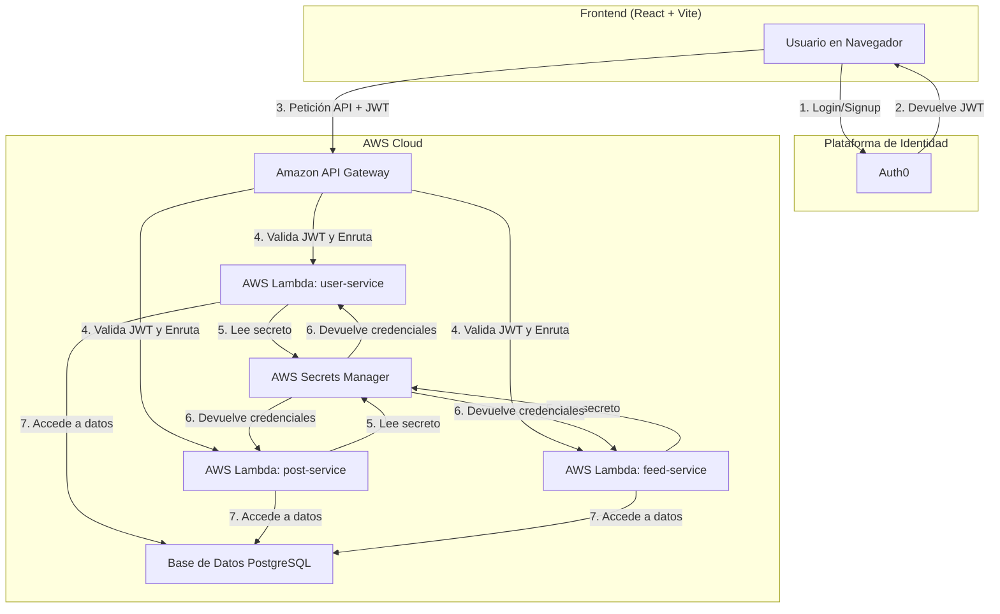

# Secure Twitter
### Santiago Carmona Pineda
### Maria Paula Rodriguez 

## Twitter App: Monolito

La primera versión del proyecto fue implementada como una aplicación monolítica con Spring Boot, concentrando en un solo despliegue la lógica de autenticación, gestión de usuarios, creación de publicaciones y consulta del stream público. Esta etapa sirvió como base funcional antes de la migración a microservicios.

En esta versión inicial, la aplicación resuelve todo el flujo principal de la experiencia tipo Twitter: el usuario inicia sesión con Auth0, obtiene un token JWT, consume la API desde el frontend, publica mensajes cortos y consulta el stream público de publicaciones.

### Objetivo de la versión monolítica

Construir una API REST sencilla y segura para una experiencia tipo Twitter, permitiendo a usuarios autenticados publicar mensajes cortos y consultar un flujo público de publicaciones desde una interfaz web.

### Funcionalidades principales

* Autenticación de usuarios mediante Auth0.
* Creación de publicaciones con un máximo de 140 caracteres.
* Consulta del stream público con todas las publicaciones disponibles.
* Documentación completa de la API con Swagger / OpenAPI.
* Consumo de la API desde una interfaz frontend web.


### 1. Resumen general

La captura principal corresponde al estado funcional del monolito en su primera etapa. Allí se observa una aplicación completa que expone sus endpoints desde una única base de código, centralizando las responsabilidades de backend, seguridad y persistencia. Esta estructura fue útil para validar el comportamiento del sistema antes de dividirlo en servicios independientes.

### 2. Swagger de la API y validación con JWT

La captura de Swagger muestra los endpoints disponibles en la aplicación y sirve como documentación interactiva de la API. Desde esta vista se pueden identificar las operaciones expuestas por el backend, los modelos de solicitud y respuesta, y la forma en que la seguridad se integra mediante JWT.



En Swagger también se aprecia que la API está protegida con autenticación Bearer. Esto significa que, para ejecutar los endpoints protegidos, el usuario debe iniciar sesión con Auth0, obtener un access token y enviarlo en la cabecera `Authorization`. Con esto se garantiza que solo los usuarios autenticados puedan crear publicaciones o acceder a información privada.

### 3. Twitter API como backend

Twitter API es el backend de la solución monolítica. Corresponde a la aplicación Spring Boot que se ejecuta localmente en `localhost:8080` y actúa como el servidor principal que recibe las requests del frontend.



Su responsabilidad es:

* Recibir las peticiones HTTP enviadas por la interfaz web.
* Validar los JWT emitidos por Auth0.
* Exponer la lógica de negocio para crear y consultar posts.
* Persistir la información en PostgreSQL.
* Servir como punto único de acceso para todas las operaciones de la versión monolítica.

En otras palabras, todo el procesamiento de negocio vive en este backend: la autenticación del token, la validación de los datos del post y el almacenamiento de la información en la base de datos.

### 4. Twitter Frontend 



Twitter Frontend es la aplicación React que se ejecuta localmente en `localhost:5173`. Esta parte representa la capa visual con la que el usuario interactúa directamente.

Desde esta interfaz el usuario puede:

* Iniciar sesión y cerrar sesión.
* Obtener acceso autenticado mediante Auth0.
* Crear nuevas publicaciones.
* Visualizar el stream público de posts.

El frontend no contiene la lógica de negocio principal; su función es consumir la API del monolito y presentar la información de forma clara y usable. Por eso, actúa como cliente de Twitter API.

### 5. Integración con Auth0

Tanto Twitter API como Twitter Frontend son aplicaciones registradas en Auth0, aunque cumplen roles distintos dentro del sistema.

Auth0 necesita conocer ambas aplicaciones porque debe distinguir quién solicita los tokens y para qué API se emitirán. En este caso:

* El frontend se registra como una aplicación SPA, ya que es el cliente que inicia el flujo de autenticación.
* El backend se registra como una API protegida, para que Auth0 emita tokens con el audience correcto y el backend pueda validar esos JWT.

Gracias a esta configuración, Auth0 puede autenticar al usuario, emitir tokens válidos para la API correcta y permitir que el monolito aplique control de acceso sobre sus endpoints protegidos.


## Twitter App: De Monolito a Microservicios Serverless en AWS

Este proyecto documenta la modernización de una aplicación web monolítica de Spring Boot a una arquitectura de microservicios completamente serverless, desplegada en Amazon Web Services (AWS). El objetivo principal fue mejorar la escalabilidad, la mantenibilidad y la agilidad del desarrollo descomponiendo el sistema original en servicios más pequeños y autónomos.

## 1. Arquitectura del Sistema

### Arquitectura Original: Monolito

El sistema inicial era una aplicación Spring Boot única que contenía toda la lógica de negocio, acceso a datos y endpoints de la API en un solo artefacto desplegable.



### Arquitectura Final: Microservicios Serverless

La arquitectura final es un sistema distribuido que aprovecha los servicios gestionados de AWS para lograr una alta disponibilidad y un escalado automático.



**Flujo de Datos y Seguridad:**

1.  **Autenticación:** El usuario se registra o inicia sesión a través de **Auth0** desde el frontend.
2.  **Token JWT:** Auth0 devuelve un `access_token` (JWT) al frontend.
3.  **Llamada a la API:** El frontend incluye este token en el encabezado `Authorization` de cada solicitud a **Amazon API Gateway**.
4.  **Enrutamiento y Autorización:** API Gateway valida el token JWT con Auth0. Si es válido, enruta la solicitud a la función **AWS Lambda** correspondiente (`user-service`, `post-service`, etc.).
5.  **Gestión de Secretos:** La función Lambda, al iniciarse, solicita las credenciales de la base de datos a **AWS Secrets Manager**.
6.  **Acceso a Datos:** Con las credenciales obtenidas, la función Lambda se conecta a la base de datos **PostgreSQL** para realizar las operaciones necesarias.

## 2. Configuración y Ejecución Local

Para ejecutar el entorno de desarrollo, es necesario configurar y ejecutar el frontend y el backend por separado.

### Prerrequisitos

*   Java 17+ y Maven
*   Node.js y npm
*   Una cuenta de Auth0 con una "API" y una "Application" configuradas.
*   Una base de datos PostgreSQL accesible (se recomienda [Neon.tech](https://neon.tech) para obtener una instancia gratuita en la nube).
*   Credenciales de AWS configuradas localmente con permisos para Secrets Manager.

### Backend (`microservices-backend`)

El backend está diseñado para ser desplegado en AWS Lambda y obtiene su configuración de AWS Secrets Manager. Para pruebas locales, se conectarían a la misma base de datos en la nube.

1.  **Construir los artefactos:**
    ```bash
    cd microservices-backend
    mvn clean package -DskipTests
    ```
    Esto generará los ficheros `.jar` en el directorio `target/` de cada microservicio, listos para ser subidos a AWS Lambda.

### Frontend (`frontend`)

1.  **Navegar al directorio:**
    ```bash
    cd frontend
    ```
2.  **Instalar dependencias:**
    ```bash
    npm install
    ```
3.  **Crear fichero de entorno:**
    Crea un archivo `.env` en la raíz de la carpeta `frontend` con los datos de tu configuración de Auth0:
    ```
    VITE_AUTH0_DOMAIN="tu-dominio.auth0.com"
    VITE_AUTH0_CLIENT_ID="tu-client-id"
    VITE_AUTH0_AUDIENCE="tu-api-identifier"
    VITE_API_BASE_URL="la-invoke-url-de-tu-api-gateway"
    ```
4.  **Ejecutar el servidor de desarrollo:**
    ```bash
    npm run dev
    ```
    La aplicación estará disponible en `http://localhost:5173`.

## 3. Informe de Pruebas

Se realizaron pruebas de extremo a extremo (End-to-End) utilizando Postman para validar la funcionalidad de la API desplegada en AWS.

*   **Herramienta:** Postman
*   **Autenticación:** Se utilizó un `Bearer Token` obtenido del flujo de inicio de sesión del frontend.

| Microservicio  | Endpoint          | Método | Resultado Esperado                                     | Estado      |
| -------------- | ----------------- | ------ | ------------------------------------------------------ | ----------- |
| **user-service** | `/users/me`       | `GET`    | Devuelve el perfil del usuario autenticado.            | ✅ **Correcto** |
| **post-service** | `/posts`          | `POST`   | Crea una nueva publicación.                            | ✅ **Correcto** |
| **post-service** | `/posts`          | `GET`    | Devuelve una lista de todas las publicaciones.         | ✅ **Correcto** |
| **feed-service** | `/feed`           | `GET`    | Devuelve el feed de publicaciones para el usuario.     | ✅ **Correcto** |

**Conclusión de las pruebas:** Todos los endpoints principales funcionan correctamente, validando el flujo completo desde la autenticación del usuario hasta la interacción con la base de datos a través de los diferentes microservicios.

